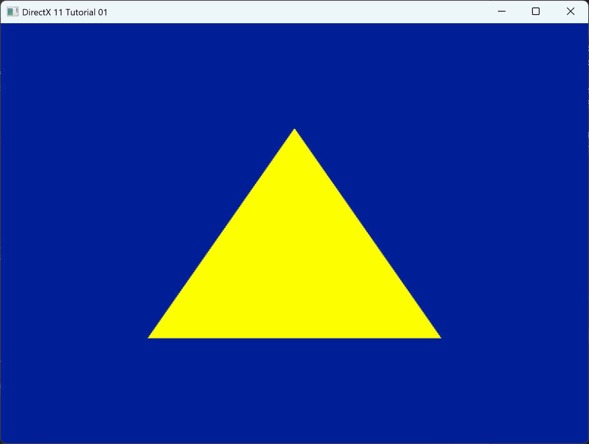
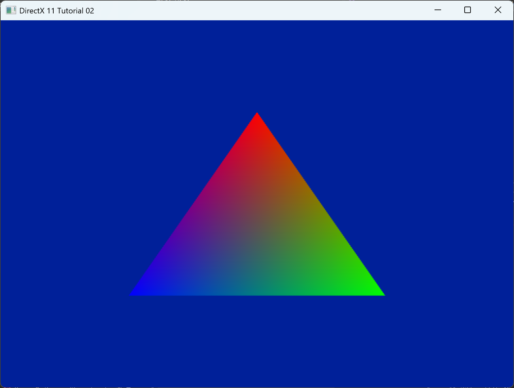
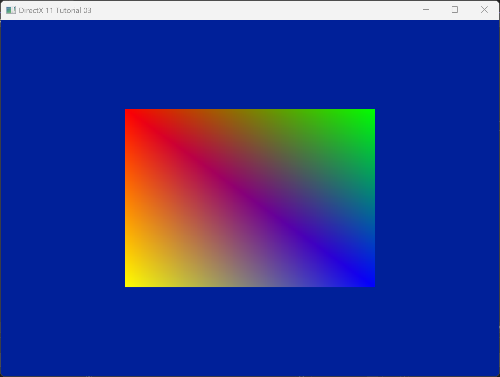
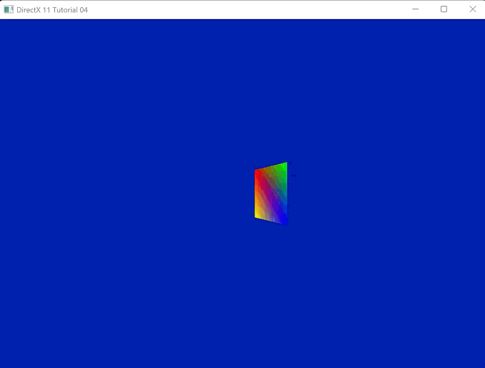
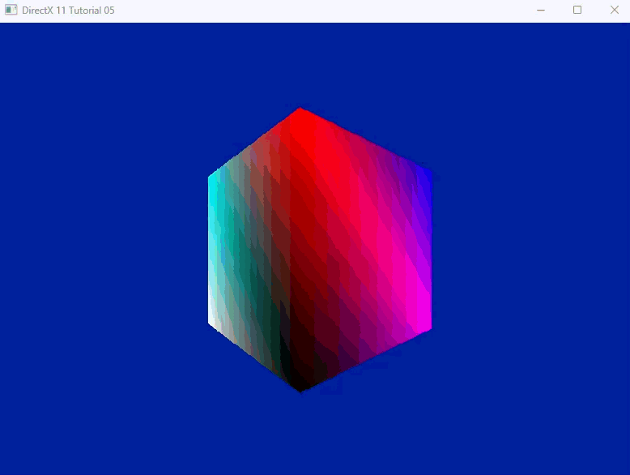
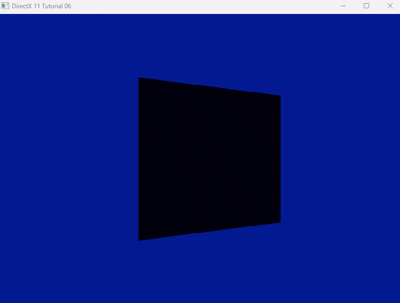

# DirectX 11 학습 (DirectX 11 Study)

DirectX 11 그래픽스 파이프라인의 기초부터 심화까지 단계별로 학습하고 구현하는 프로젝트입니다.

## 학습 진행 상황 (Progress)

### Chapter 01: 기본 파이프라인 & 삼각형 그리기

- **학습 내용**: Device 초기화, 스왑 체인, 버퍼 생성, 기본 쉐이더 작성
- **결과**: 파란 배경에 정적인 노란색 삼각형 출력

  

---

### Chapter 02: 색상 보간 (Color Interpolation)

- **학습 내용**: Input Layout 확장, 정점 색상 데이터(Color) 전달, 래스터라이저 보간 원리 이해
- **결과**: RGB 그라데이션이 적용된 삼각형 출력

  

---

### Chapter 03: 인덱스 버퍼 (Index Buffer)

- **학습 내용**: 정점 중복 제거를 위한 인덱스 버퍼 개념 이해, 사각형(Quad) 구성을 위한 토폴로지 정의, `DrawIndexed` 호출
- **결과**: 인덱스 버퍼를 사용하여 4개의 정점으로 사각형 렌더링

  

---

### Chapter 04: 행렬 변환 (Matrix Transformations)

- **학습 내용**: 월드/뷰/프로젝션(WVP) 행렬의 개념, 상수 버퍼(Constant Buffer)를 통한 CPU-GPU 데이터 공유, `DirectXMath` 라이브러리 활용
- **결과**: Y축으로 회전하는 3D 사각형 (Back-face Culling 비활성화)

  

---

### Chapter 05: 3D 큐브 & 깊이 버퍼 (Depth Buffer)

- **학습 내용**: 깊이 버퍼(Z-Buffer)의 원리, DepthStencilView 생성 및 바인딩, 큐브 메쉬 데이터 구성
- **결과**: 깊이 테스트를 통해 앞뒤 관계가 명확한 3D 큐브 렌더링

  

---

### Chapter 06: 조명 (Diffuse Lighting)

- **학습 내용**: 법선 벡터(Normal Vector)의 개념, 램버트(Lambert) 반사 모델, 쉐이더에서의 조명 연산(`dot` product)
- **결과**: 빛의 방향과 표면의 각도에 따라 명암이 달라지는 입체적인 큐브

  

---